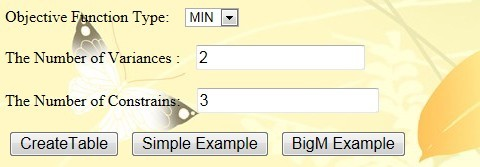
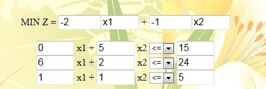
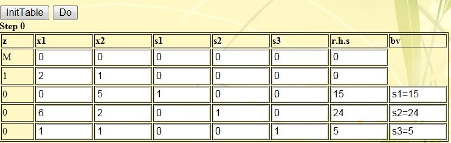
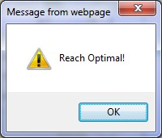
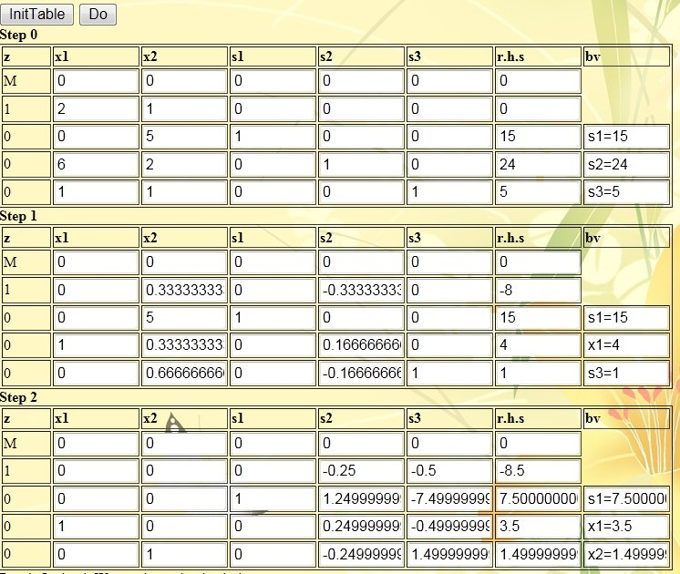
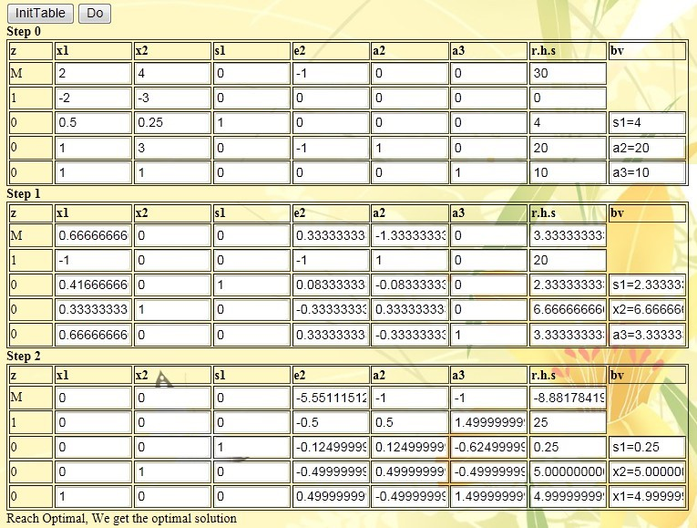
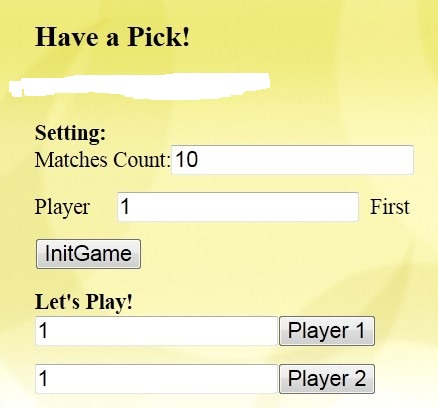
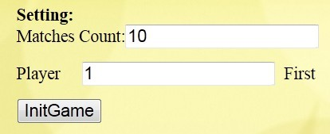
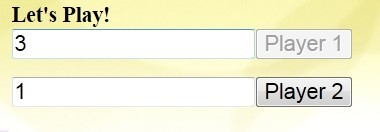
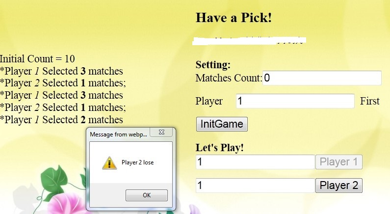

# Simplex algorithm & Big M method in JavaScript

> Developed by Donghua Chen, Beijing Jiaotong University

## Overview
**Management Operations Research** is a very useful course, which contains various kinds of useful management and operations research algorithm. Through the program designing, we apply our knowledge to solve the problem by programming based on the algorithm in the textbook, and then it can help us to know better about the true meaning and spirit of different algorithm in operations research. This program reports contains two part of program: A common solving program based on the Simplex Algorithm & Big M Method and A game of picking matches. The programs adopt the JavaScript program language, which is easy to run in any platform with a browser.

## History
This project hosts the source codes of my undergraduate study about Operations Research. The project contains two algorithms' implementation, namely, Simplex algorithm and **Pick Matches Game** based on the Big M method.

The most interesting part of this project is that their algorithms are designed in JavaScript, a lightweight computer programming language usually used in web browsers for displaying web pages. It also means you can run the algorithm simply by open the HTML source file in your web browsers. And it works perfectly. No IDE, no compiler!

## Simplex Algorithm & Big M Method

### Program design
The algorithms adopted by this program are all based on the simple simplex method in the book and the solving algorithm of the big M method. The overall design process of this program is that the user enters the number of variables and constraints → the user enters the variable coefficients in the objective function and constraint equations automatically generated by the software → the user clicks the button to let the software automatically complete the program solving process → the program gives the final series The solved simplex table and the final solution.

Core code:
```js
function InitTable() {
        var t = new Array();
        var Count = parseInt(VN);
        //obtain total counts of table
        for (i = 0; i < CN; i++) {
            s = document.getElementById("equ" + i).options[document.getElementById("equ" + i).selectedIndex].text;
            if (s == "<=") {
                Count++;
            }
            if (s == ">=") {
                Count = Count + 2;
            }
            if (s == "=") {
                Count++;
            }
        }
        Count = Count + 1; //add z var
        //simplify function
        for (j = 1; j <= VN; j++) {
…
        }
        for (k = j; k < Count; k++) {
            t[0][k] = 0;
        }
        //handle table header
        for (k = 1; k <= VN; k++) {
        }
        //handle constraints
        var index;
        index = 1;
        for (i = 1; i <= CN; i++) {
            t[i] = new Array(Count);
            t[i][0] = 0;
            for (j = 1; j < Count; j++) {
                if (j <= VN) {
                   …
                }
                if (j > VN) {
…
                }
            }
            bb = document.getElementById("equ" + (i - 1)).options[document.getElementById("equ" + (i - 1)).selectedIndex].text;
            if (bb == "<=") {
             …
            }
            if (bb == ">=") {
              …
            }
            if (bb == "=") {
        …
            }
        }
        ////////////////////////////////////////////////////////
        a = new Array(parseFloat(CN) + 1);
        for (i = 0; i < a.length; i++) {
            a[i] = new Array(Count - 1);
        }
        b = new Array(parseFloat(CN) + 1); 
        row = parseFloat(CN) + 1;
        col = Count - 1;
        M = new Array(col+1);
        //////////////////////////////////////////////
        for (i = 0; i < row; i++) {
            for (j = 0; j < col; j++) {
                a[i][j] = t[i][j + 1];
            }
            b[i] = rhs[i];
        }
        //////////////////////////////////////////
        var te;
        for(i=0;i<col+1;i++)
        M[i]=0;
        for (j = 0; j < col; j++) {
            if (a[0][j] == "M"||a[0][j]=="-M") {
              …
                }
            }
        }
        showtable();
    }

```

### Demo of simplex algorithm
(1) Enter the number of variables and the number of constraints, and select the type of objective function to be solved.
 


(2) Click the button Create Table, and enter the relevant parameters in the objective function and constraint input box automatically generated by the software, as shown in the figure below:
 


(3) Click the button InitTable to initialize the simplex table, as shown in the figure below.
 


(4) Click the Do button, and then a prompt box will pop up, prompting you to obtain the optimal solution.
 


(5) To obtain the optimal solution of the operation, enter a series of tables, and the final table is the optimal solution.
 


From the last table, we can find the optimal solution (x1, x2, s1, s2)=(3.5, 1.5, 7.5, 0, 0), which is exactly the same as the book result, which verifies the correctness of the algorithm design.

### Demo of the Big M method



Finally, we get the optimal solution (x1,x2,s1,e2,a2,e3)=(5,5,0.25,0,0,0), which is exactly the same as the result of the sample problem in the book, so it verifies that the big M in the program The correctness of law design.

## Match-picking Game
The idea of this match-picking game is derived from the recursive part of the dynamic programming in the English textbook of Operations Research. The match-picking game there is a single-player-to-computer game, and the match-picking game in this report is a two-player game. The core idea is still the principle of recursion, but this recursion is stepwise. The interface of the program is shown in the figure below:

 

 Core code:
 ```js
function init() {
                t1.value = 1;
                t2.value = 1;
                matches = parseInt(count.value);
                curr = parseInt(tt.value);
                if (curr == 1) {
                    b1.disabled = false;
                    b2.disabled = true;
                } else {
                    b1.disabled = true;
                    b2.disabled = false;
                }
                ad.innerHTML = "Initial Count = " + matches+"</br>";
            }
            function pick() {
                var t = 0;
                if (curr == 1) {
                    t = parseInt(t1.value)
                    if (!(t <= 3 && t >= 1)) {
                        alert("the picked matches must be between 1 and 3");
                        return;
                    }
                    matches -= t;
                    curr = 2;
                    t1.value = 1;
                    b1.disabled = true;
                    b2.disabled = false;
                } else {
                    t = parseInt(t2.value)
                    if (!(t <= 3 && t >= 1)) {
                        alert("the picked matches must be between 1 and 3");
                        return;
                    }
                    matches -= t;
                    curr = 1;
                    t2.value = 1;
                    b1.disabled = false;
                    b2.disabled = true;  
                }
                     if (curr == 2) {
                ad.innerHTML += "*Player <i>1</i> Selected <b>" + t + "</b> matches<br/>";
                } else {
                ad.innerHTML += "*Player <i>2</i> Selected <b>" + t + "</b> matches;<br/> ";
            }
            count.value = matches;
            if (matches <= 1) {
                if (curr == 2) {
                    alert("Player 2 lose");
                    ad.innerHTML += "Player 2 lose!";
                    return;
                } else {
                ad.innerHTML += "Player 1 lose";
                    alert("Player 1 lose!");
                    return;
                }
            }
            }

 ```

Let's demonstrate how to play the game.
(1) First set the relevant parameters of the game.

 

We set the total number of matches in the game to 10, and Player 1 picks it first. Then we get the following game interface:

 
 
(2) Player 1 first picks up matches. First, Player1 enters the number of matches to be picked up into the text box, press Player 1, and then it is Player2's turn, as shown in the figure below:

 
 
Then Player 2 enters the number of matches to be picked, and clicks the button to alternate.
(3) When the last match is left, a dialog box pops up to remind who has lost.


## Conclusions
Operations research itself is an important question, and its essential role is very large in today's society, but only through the combination of theory and practice and applying the knowledge of books to practice, what we have learned will become alive. The programming implementation of the relevant algorithms of the course, what we learned is not only the boring knowledge in the books, but also the ability to use knowledge across disciplines, combining programming and operations research theory, and showing strong vitality through our course practice .